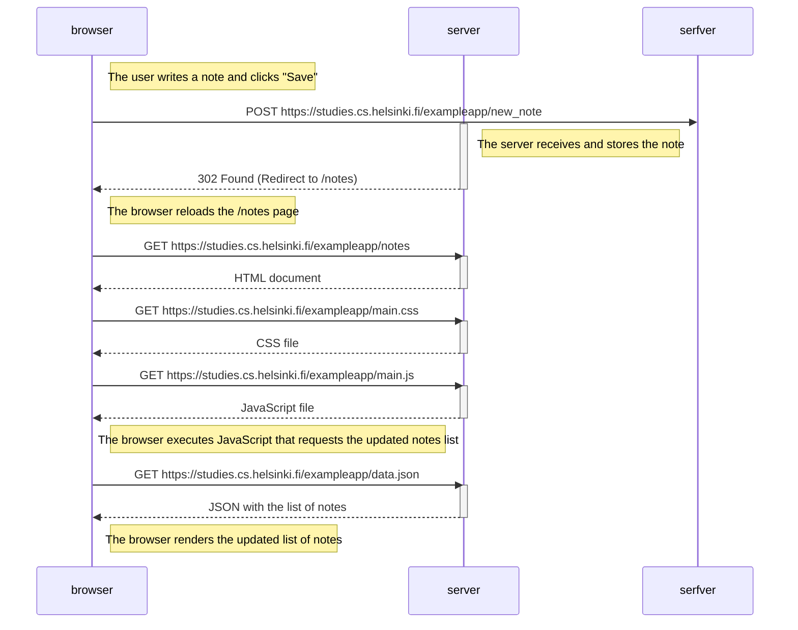

```mermaid
    sequenceDiagram
    participant browser
    participant server

    Note right of browser: The user writes a note and clicks "Save"
    browser->>serfver: POST https://studies.cs.helsinki.fi/exampleapp/new_note
    activate server
    Note right of server: The server receives and stores the note
    server-->>browser: 302 Found (Redirect to /notes)
    deactivate server

    Note right of browser: The browser reloads the /notes page

    browser->>server: GET https://studies.cs.helsinki.fi/exampleapp/notes
    activate server
    server-->>browser: HTML document
    deactivate server

    browser->>server: GET https://studies.cs.helsinki.fi/exampleapp/main.css
    activate server
    server-->>browser: CSS file
    deactivate server

    browser->>server: GET https://studies.cs.helsinki.fi/exampleapp/main.js
    activate server
    server-->>browser: JavaScript file
    deactivate server

    Note right of browser: The browser executes JavaScript that requests the updated notes list

    browser->>server: GET https://studies.cs.helsinki.fi/exampleapp/data.json
    activate server
    server-->>browser: JSON with the list of notes
    deactivate server

    Note right of browser: The browser renders the updated list of notes

```
