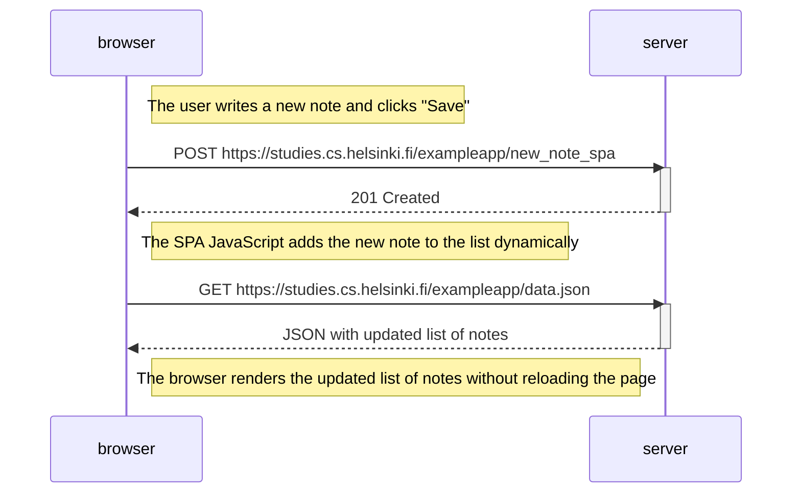

```mermaid
    sequenceDiagram
    participant browser
    participant server

    Note right of browser: The user writes a new note and clicks "Save"
    browser->>server: POST https://studies.cs.helsinki.fi/exampleapp/new_note_spa
    activate server
    server-->>browser: 201 Created
    deactivate server

    Note right of browser: The SPA JavaScript adds the new note to the list dynamically

    browser->>server: GET https://studies.cs.helsinki.fi/exampleapp/data.json
    activate server
    server-->>browser: JSON with updated list of notes
    deactivate server

    Note right of browser: The browser renders the updated list of notes without reloading the page

```
